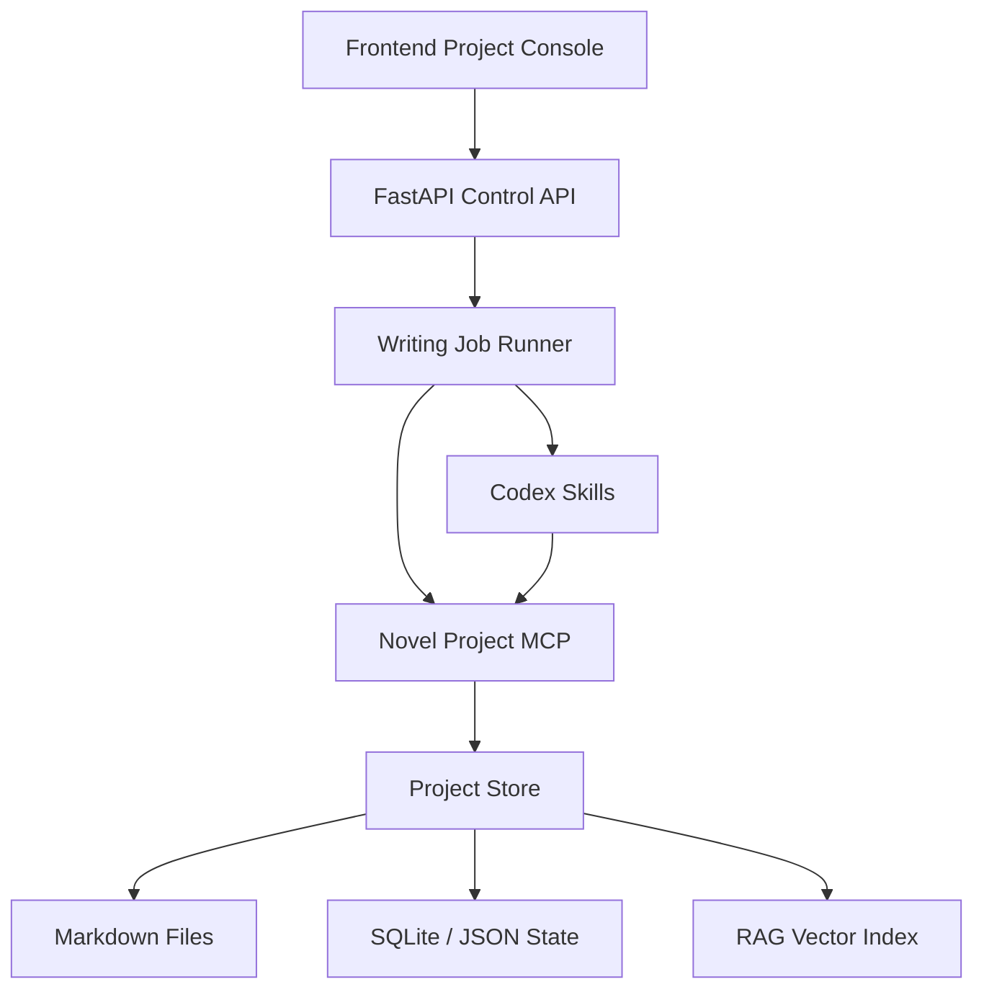
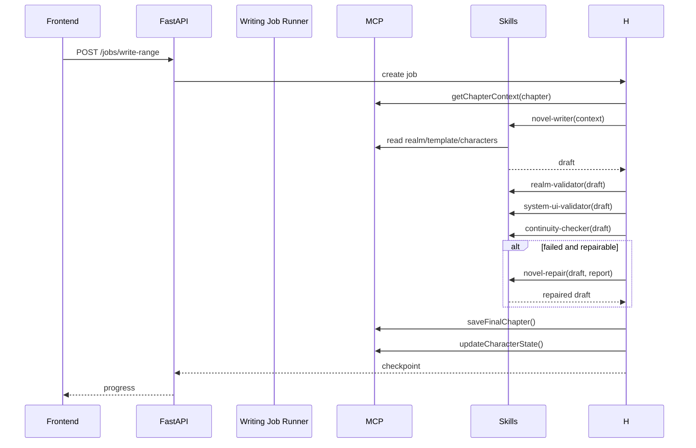

# AI Novel Writing System Architecture

本项目应从“后端接口 + Prompt 拼接”的应用，升级为一个可编排、可校验、可恢复的长篇小说写作系统。核心原则仍遵循根目录 `AGENTS.md`：全局总纲 -> 事件时间线 -> 章节大纲 -> 正文内容，但运行机制改为 Skill + MCP + Writing Job Runner 分层协作。

## 1. 目标

- 支持从全局总纲持续生成章节正文，直到目标章节或目标字数完成。
- 境界、金手指 UI、角色状态、时间线不再硬编码，而是作为结构化项目数据被读取、校验和注入。
- 生成过程可断点恢复，失败后不会污染已通过校验的章节。
- Writer Agent 专注创作，校验、修复、状态更新由独立能力处理。

## 2. 分层架构



### Frontend Project Console

前端不直接拼 Prompt，只负责配置、启动任务、查看进度和处理人工确认。

- 境界管理：维护 `RealmLevel[]` 的顺序、名称、特征、经验阈值。
- 系统模版：维护金手指 UI 模版与变量说明。
- 写作控制台：启动连续生成、暂停、恢复、重试、查看校验报告。
- 时间线视图：查看事件节点的时间、人物、地点、事件和因果影响。

### FastAPI Control API

API 层只做任务入口和配置管理，不承担复杂写作逻辑。

- `POST /api/jobs/write-range`：创建连续写作任务。
- `POST /api/jobs/{id}/pause`：暂停。
- `POST /api/jobs/{id}/resume`：恢复。
- `GET /api/jobs/{id}`：查看进度。
- `GET/PUT /api/preferences`：配置境界与系统 UI。
- `GET/PUT /api/timeline`：管理结构化时间线。

### Writing Job Runner

Writing Job Runner 是长流程调度器，负责把“写一章”扩展为“稳定写很多章”。

- 为每章创建 `ChapterJob`。
- 逐章执行：构建上下文 -> 写作 -> 校验 -> 修复 -> 保存 -> 更新状态。
- 每个阶段写入 checkpoint。
- 失败时保留错误报告，允许从失败阶段继续。

### Codex Skills

Skill 是可替换的专业能力单元，不直接持久化业务数据。

- `novel-outline-planner`：从总纲生成结构化时间线。
- `novel-chapter-planner`：从时间线节点拆 3-5 个章节大纲，并使用 RAG 检索旧章节、角色状态和未回收伏笔。
- `novel-writer`：根据章节上下文生成正文。
- `novel-realm-validator`：检查境界顺序、经验、实力上限。
- `novel-system-ui-validator`：检查系统面板是否匹配模版。
- `novel-continuity-checker`：检查时间线、人物状态、地点衔接。
- `novel-repair`：对校验失败点进行定点修复。
- `novel-resume`：针对截断章节续写收束。

### Novel Project MCP

MCP 是 Agent 与项目数据交互的边界。Writer 不应直接读散落文件，而应通过 MCP 获取结构化上下文。

- 读取项目配置、境界表、系统 UI 模版。
- 读取当前章节大纲和相关时间线节点。
- 读取角色状态、主角境界、地点、上一章连续性摘要。
- 保存章节草稿、校验报告和最终正文。

## 3. 数据模型

### TimelineEvent

```json
{
  "id": "event-001",
  "time": "第一卷第3天傍晚",
  "characters": ["林凡", "秦霜夜"],
  "location": "红星幼儿园操场",
  "event": "林凡第一次暴露异常体能，引起秦霜夜注意",
  "causal_effect": "秦霜夜开始观察主角，为后续羁绊铺垫",
  "source_outline_id": "outline-volume-1"
}
```

### RealmLevel

```json
{
  "id": "qi-refining",
  "name": "炼气期",
  "order": 1,
  "features": "引气入体，灵力初成",
  "min_exp": 0,
  "max_exp": 999
}
```

### UserPreference

```json
{
  "realm_levels": [],
  "system_ui_template": "[宿主：{name} | 等级：{level}]",
  "system_ui_variables": ["name", "level", "exp", "task"],
  "validation_policy": {
    "realm": "block",
    "system_ui": "auto_repair_then_block",
    "continuity": "auto_repair_then_warn"
  }
}
```

### ChapterJob

```json
{
  "id": "job-chapter-052",
  "chapter": 52,
  "status": "validating",
  "stage": "system_ui_validator",
  "attempts": 1,
  "input_hash": "sha256...",
  "draft_path": "正文/.drafts/第52章.md",
  "final_path": "正文/第52章-炼化灵药与突破.md",
  "validation_report_id": "report-052",
  "created_at": "2026-05-05T10:00:00+08:00",
  "updated_at": "2026-05-05T10:05:00+08:00"
}
```

### ValidationReport

```json
{
  "chapter": 52,
  "passed": false,
  "checks": [
    {
      "type": "realm",
      "severity": "blocker",
      "message": "主角境界「金丹期」不在当前允许进度内",
      "repairable": true
    }
  ]
}
```

## 4. 章节生成流水线

规划顺序必须固定为：


RAG 应在两个规划节点发挥作用：

- 生成事件时间线时，检索世界观、主角卡、金手指、角色库，保证事件不脱离设定。
- 生成章节大纲时，检索相关旧章节、相似场景、角色状态和未回收伏笔，保证章节承上启下。



## 5. Prompt 注入原则

Prompt 不再由后端字符串随意拼接，而由 MCP 提供标准上下文包。

```json
{
  "chapter": 52,
  "timeline_event": {},
  "chapter_outline": "",
  "previous_continuity": "",
  "active_characters": [],
  "protagonist_state": {},
  "realm_contract": {},
  "system_ui_contract": {},
  "style_contract": {},
  "forbidden_crossing": []
}
```

Writer Skill 只能基于这个上下文包创作，不能自行读取旧文件或生成新的境界/UI 规则。

## 6. 校验策略

- 境界校验：确定性规则优先，AI 只用于解释复杂冲突。
- 系统 UI 校验：模版编译为正则或 AST，必须机器校验。
- 时间线校验：当前章节不得提前消耗下一章事件节点。
- 人物状态校验：死亡、下线、受伤、地点变更必须与状态表一致。
- 截断校验：检测半句、低字数、未收束结尾，触发 `novel-resume`。

## 7. 落地原则

- 旧 `SkillExecutor` 暂时保留，作为兼容层。
- 新增 Writing Job Runner 时先走“旁路模式”：不破坏现有写作按钮。
- MCP 先用本地 Python 服务/模块模拟，稳定后再迁移为正式 MCP server。
- 所有新写入数据放入 `.webnovel/runtime`，避免污染正文和设定集。
