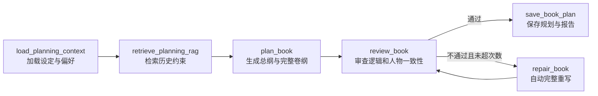
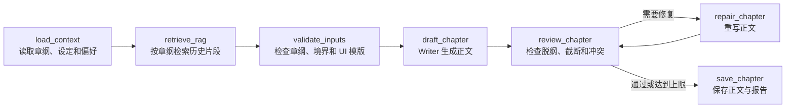
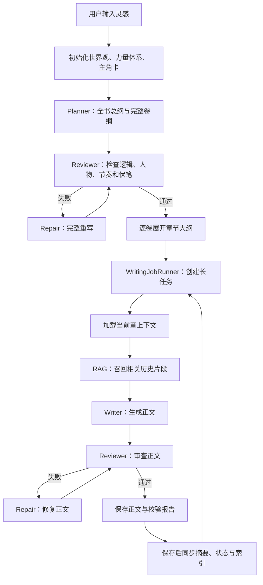

# 小猫写作：项目速通手册与面试指南

> 适用项目：`langgraph-novel-agent`  
> 阅读目标：先用 20 分钟建立整体认识，再沿着代码入口逐层深入。  
> 项目定位：面向 200 万字以上网络小说的 AI 辅助创作平台，而不是单次文本生成 Demo。

---

## 1. 一句话介绍

小猫写作是一个基于 Vue、FastAPI 和 LangGraph 的长篇网络小说创作系统。它将灵感规划、总纲、卷纲、章节大纲、正文写作、审查修复、RAG 检索、长期记忆和断点续写组织成可追踪的工作流，重点解决长篇生成中常见的人物跑偏、情节断裂、设定遗忘和任务中断问题。

面试时可以先说：

> 我做的是一个面向长篇网文的 Agent 化写作工作流。它不是直接让大模型连续写几百万字，而是先生成总纲和完整卷纲，再逐卷展开章纲，逐章组装上下文、检索历史信息、生成正文、审查和修复。项目使用 LangGraph 表达状态图，使用轻量级混合 RAG 保持长期一致性，并通过持久化任务状态支持断点续写。

---

## 2. 为什么不能直接让模型写 200 万字

大模型一次请求的上下文长度有限。即使模型支持较长上下文，把整本小说全部塞进 Prompt 也会带来成本高、速度慢、重点稀释和逻辑漂移等问题。

长篇生成需要分层规划：

```text
人类灵感
→ 全书总纲
→ 完整卷纲
→ 首批卷纲展开为章节大纲
→ 单章上下文组装
→ RAG 检索相关历史片段
→ 正文生成
→ 审查与修复
→ 正文和校验报告写回
→ 保存后同步摘要、状态和向量索引
→ 下一章
```

这套结构的核心思想是：**模型负责创作，但系统负责约束、记忆和恢复。**

> 当前边界：手动保存正文时已经会同步连续性摘要和 RAG 索引；自动写作图目前直接保存正文与校验报告。将保存后同步完整纳入自动图节点，是后续需要继续补齐的工程项。

---

## 3. 技术栈

| 层级 | 技术 | 用途 |
| --- | --- | --- |
| 前端 | Vue 3、Vite、Vue Router、Pinia、Axios | 写作工作台、配置页面、登录与 API 调用 |
| 后端 | FastAPI、Pydantic、Uvicorn | REST API、请求校验、服务编排 |
| 工作流 | LangGraph | 规划图、正文写作图、条件分支和修复循环 |
| 大模型调用 | OpenAI 兼容 Chat Completions API | 允许接入不同兼容服务商 |
| RAG | SQLite、Embedding、BM25、余弦相似度、RRF | 长期语义记忆与混合检索 |
| Embedding | `Qwen/Qwen3-Embedding-8B` | 将章节和设定转换为向量 |
| 账号数据 | MySQL 8.4 | 生产环境长期存储用户账号 |
| 临时状态 | Redis 7 | 验证码和登录 token |
| 文件存储 | Markdown、JSON、SQLite | 小说正文、设定、任务状态和向量库 |
| 部署 | Docker Compose、Nginx | 一键启动前后端、MySQL 和 Redis |

---

## 4. 顶层目录结构

```text
langgraph-novel-agent/
├─ backend/                    # FastAPI 后端和 LangGraph 工作流
├─ frontend/                   # Vue 写作工作台
├─ deploy/                     # Docker、Nginx 和部署脚本
├─ docs/                       # 项目文档
├─ .claude/
│  └─ scripts/data_modules/    # 可复用的数据模块和 RAG 实现
├─ scripts/                    # 辅助脚本
├─ .env.example                # 本地环境变量示例
└─ README.md                   # 项目基础说明
```

最重要的阅读顺序：

```text
backend/main.py
→ backend/routers/pipeline.py
→ backend/graphs/book_planning_graph.py
→ backend/job_runner/writing_job_runner.py
→ backend/graphs/chapter_write_graph.py
→ backend/services/skill_executor.py
→ .claude/scripts/data_modules/rag_adapter.py
```

---

## 5. 后端目录结构

```text
backend/
├─ main.py                     # FastAPI 应用入口，注册所有路由
├─ dependencies.py             # 从参数或 Header 解析当前项目目录
├─ contracts/
│  └─ novel.py                 # 时间线、章纲、任务和校验报告模型
├─ routers/                    # HTTP API 层
│  ├─ pipeline.py              # 灵感一键成书入口
│  ├─ graph.py                 # 单章 LangGraph 写作接口
│  ├─ jobs.py                  # 长任务创建、运行、暂停与恢复
│  ├─ outlines.py              # 总纲、卷纲和章纲管理
│  ├─ timeline.py              # 事件时间线生成、编辑与扩展
│  ├─ chapters.py              # 正文读写和保存后同步
│  ├─ rag.py                   # RAG 检索与索引接口
│  ├─ preferences.py           # 境界列表和系统 UI 模版
│  ├─ auth.py                  # 邮箱、密码和 Linux.do 登录
│  └─ admin.py                 # 超级管理员接口
├─ graphs/
│  ├─ book_planning_graph.py   # 全书规划 Agent 化工作流
│  └─ chapter_write_graph.py   # 单章正文 Agent 化工作流
├─ job_runner/
│  └─ writing_job_runner.py    # 持久化长任务调度器
├─ runtime/
│  └─ project_store.py         # 本地运行时 JSON 存储
├─ services/
│  ├─ ai_service.py            # OpenAI 兼容 API 客户端
│  ├─ skill_executor.py        # 现有写作能力、Prompt 组装和上下文构建
│  ├─ user_preferences.py      # 境界系统和系统 UI 模版持久化
│  ├─ auth_service.py          # MySQL、Redis、SMTP 与本地降级
│  ├─ user_workspace.py        # 用户目录隔离和示例小说复制
│  └─ projects_manager.py      # 项目管理
└─ harness/
   └─ writing_harness.py       # 旧名称兼容层，实际指向 WritingJobRunner
```

### 5.1 后端入口

`backend/main.py` 创建 FastAPI 应用，并注册 `/api/projects`、`/api/pipeline`、`/api/graph`、`/api/jobs`、`/api/rag`、`/api/auth` 和 `/api/admin` 等路由。

本地后端启动命令：

```powershell
cd G:\novel-project\langgraph-novel-agent\backend
uvicorn main:app --reload --port 8001
```

健康检查：

```text
GET http://127.0.0.1:8001/api/health
```

---

## 6. 前端目录结构

```text
frontend/
├─ src/
│  ├─ main.js                  # Vue 入口
│  ├─ App.vue                  # 根组件
│  ├─ api/index.js             # Axios 封装和全部 API 调用
│  ├─ router/index.js          # 页面路由和登录守卫
│  ├─ stores/                  # Pinia 状态管理
│  ├─ components/              # 通用组件
│  └─ views/
│     ├─ LoginView.vue         # 邮箱、密码、验证码和 Linux.do 登录
│     ├─ WorkspaceLayout.vue   # VS Code 风格三栏布局
│     ├─ InspirationPipelineView.vue # 灵感一键成书
│     ├─ OutlineView.vue       # 大纲编辑
│     ├─ TimelineView.vue      # 可选事件时间线编辑
│     ├─ WriteView.vue         # 正文编辑与生成
│     ├─ RealmConfigView.vue   # 境界管理
│     ├─ SystemUIConfigView.vue # 系统面板模板
│     ├─ RagView.vue           # RAG 检索
│     └─ AdminView.vue         # 超级管理员页面
├─ vite.config.js              # 开发代理配置，默认转发到 8001
└─ package.json
```

本地前端启动：

```powershell
cd G:\novel-project\langgraph-novel-agent\frontend
npm install
npm run dev
```

浏览器访问：

```text
http://localhost:5173/
```

---

## 7. 核心功能一：灵感一键成书

入口：

```text
POST /api/pipeline/from-inspiration
```

对应代码：

```text
backend/routers/pipeline.py
frontend/src/views/InspirationPipelineView.vue
```

用户只需要输入一段剧情灵感，并设置目标字数、单章字数、每卷章节数和自动校正次数。

后端执行：

```text
初始化项目设定
→ 调用全书规划图
→ 生成总纲和完整卷纲
→ 展开首批卷的逐章大纲
→ 创建 WriteRangeJob
→ 可选：立即生成第 1 章
```

### 7.1 为什么完整卷纲一次性生成，章节大纲按卷展开

总纲和完整卷纲需要一次性完成，否则后期容易失控。但如果一次生成几百章详细章纲，模型容易输出截断或质量下降。

因此系统采用两级策略：

```text
一次生成：全书总纲 + 全部卷纲
分批生成：每卷详细章节大纲
逐章生成：正文
```

这是长篇生成中比较务实的工程折中。

---

## 8. 核心功能二：全书规划 LangGraph

代码入口：

```text
backend/graphs/book_planning_graph.py
```

状态对象：

```text
BookPlanningState
```

主要字段：

| 字段 | 含义 |
| --- | --- |
| `inspiration` | 用户输入的剧情灵感 |
| `target_words` | 目标总字数 |
| `total_chapters` | 估算总章节数 |
| `total_volumes` | 估算总卷数 |
| `context` | 世界观、力量体系、主角卡、金手指和用户偏好 |
| `rag_context` | RAG 检索得到的历史约束 |
| `dossier` | Planner 生成的总纲和完整卷纲 |
| `review` | Reviewer 返回的 JSON 审查结果 |
| `repair_attempts` | 自动校正次数 |

工作流：



### 8.1 Planner 节点

Planner 不要求用户补齐所有细节。它会根据灵感、设定、境界表、系统 UI 模版和 RAG 结果主动补全：

- 世界观规则；
- 主角动机和人物弧光；
- 全书主线与结局方向；
- 每卷冲突、爽点和高潮；
- 境界升级路径；
- 伏笔埋设与回收。

### 8.2 Reviewer 节点

Reviewer 单独检查：

- 卷纲是否从第 1 卷连续到最后一卷；
- 主线因果是否闭合；
- 人物目标、关系和能力是否突然变化；
- 是否符合网文节奏；
- 是否重复剧情、战力膨胀或结局脱节。

### 8.3 Repair 节点

审查不通过时，Repair 根据问题完整重写规划，再交回 Reviewer 复查。默认最多修复 2 次，前端允许设置 1 至 3 次。

### 8.4 保存结果

规划保存到：

```text
大纲/总纲.md
大纲/全书卷纲/第1卷-卷纲.md
大纲/全书卷纲/第2卷-卷纲.md
...
.webnovel/runtime/planning_reports/plan-*.json
```

---

## 9. 核心功能三：单章正文 LangGraph

代码入口：

```text
backend/graphs/chapter_write_graph.py
```

状态对象：

```text
ChapterWriteState
```

工作流：



单章入口：

```text
POST /api/graph/write-chapter
```

正文生成不是“裸 Prompt”。系统会把当前章纲、前文摘要、上一章结尾、人物状态、世界观、力量体系、用户境界表、系统 UI 模版和 RAG 检索结果组合成上下文。

---

## 10. Agent、工作流与多 Agent 风格

### 10.1 这是不是 Agent

准确说法是：

> 项目使用 LangGraph 实现 Agent 化的多节点工作流。Planner、Reviewer、Repair 和 Writer 承担不同 Agent 职责，但节点顺序、条件路由和最大重试次数仍由系统控制。

不要说：

> 项目部署了多个完全自治的 Agent 服务。

当前并没有将每个 Agent 独立部署为一个服务，也没有让模型无限制自主选择所有工具。

### 10.2 为什么选择可控工作流

长篇小说比开放式聊天更强调一致性。完全自治的 Agent 虽然灵活，但更容易偏离剧情、反复循环或产生不可预测成本。

LangGraph 适合这个场景，因为它提供：

- 显式节点；
- 共享状态；
- 条件分支；
- 修复循环；
- 可观察事件；
- 未来扩展 Checkpointer 的入口。

### 10.3 当前“多 Agent”体现在哪里

| 职责 | 节点 | 作用 |
| --- | --- | --- |
| Planner | `plan_book` | 生成总纲和完整卷纲 |
| Reviewer | `review_book`、`review_chapter` | 检查规划和正文质量 |
| Repair | `repair_book`、`repair_chapter` | 根据审查意见重写 |
| Context Agent | `_execute_context_agent` | 组装正文前的上下文 |
| Writer | `draft_chapter` | 生成正文草稿 |

---

## 11. 长任务与断点续写

代码入口：

```text
backend/job_runner/writing_job_runner.py
backend/runtime/project_store.py
backend/routers/jobs.py
```

任务接口：

| 接口 | 用途 |
| --- | --- |
| `POST /api/jobs/write-range` | 创建章节区间任务 |
| `GET /api/jobs/{job_id}` | 查看任务状态 |
| `POST /api/jobs/{job_id}/run-next` | 只写下一章 |
| `POST /api/jobs/{job_id}/run` | 持续写到完成或阻塞 |
| `POST /api/jobs/{job_id}/pause` | 暂停 |
| `POST /api/jobs/{job_id}/resume` | 恢复 |

任务状态保存在：

```text
.webnovel/runtime/jobs/*.json
```

每章状态包括：

```text
pending
→ building_context
→ writing
→ completed
```

失败后会写入错误信息。如果设置 `stop_on_blocker=true`，任务会暂停，后续可以继续恢复。

### 11.1 不要误称 Harness

项目中仍保留：

```text
backend/harness/writing_harness.py
```

但它只是旧名称兼容层：

```python
WritingHarness = WritingJobRunner
```

面试时应该说：

> 项目实现了一个轻量级持久化任务调度器 `WritingJobRunner`，用于逐章执行、失败暂停和断点续写。它不是某个官方 Harness 框架。

---

## 12. 记忆系统

项目同时使用短期记忆、结构化长期记忆和语义长期记忆。

### 12.1 短期记忆

短期记忆是每次生成当前章节前动态组装的上下文，主要来自：

- 当前章节大纲；
- 下一章边界；
- 上一章结尾；
- 最近章节摘要；
- 上一章连续性摘要；
- 主角状态；
- 活跃角色；
- 世界观和力量体系；
- 自定义境界；
- 系统 UI 模版；
- RAG 召回片段。

核心代码：

```text
backend/services/skill_executor.py
backend/graphs/chapter_write_graph.py
```

### 12.2 结构化长期记忆

结构化记忆适合保存精确事实：

```text
设定集/世界观.md
设定集/力量体系.md
设定集/主角卡.md
设定集/角色库/
大纲/总纲.md
大纲/全书卷纲/
正文/.continuity/第N章_状态.md
.webnovel/state.json
.webnovel/runtime/
```

### 12.3 语义长期记忆

语义记忆适合回答“哪些历史内容和当前章纲相关”：

```text
.webnovel/vectors.db
```

它保存文本切片和 Embedding 向量，用于语义检索。

### 12.4 为什么结构化记忆和向量记忆都需要

向量库适合模糊召回，但不适合当唯一事实来源。

例如：

```text
“主角当前境界是什么？”
```

应该优先读取结构化状态，而不是仅依赖语义相似度。  
而：

```text
“当前宗门冲突和前文哪些场景有关？”
```

更适合交给 RAG 检索。

---

## 13. RAG 如何实现

代码位置：

```text
.claude/scripts/data_modules/config.py
.claude/scripts/data_modules/api_client.py
.claude/scripts/data_modules/rag_adapter.py
backend/routers/rag.py
```

默认 Embedding 模型：

```text
Qwen/Qwen3-Embedding-8B
```

默认向量库：

```text
.webnovel/vectors.db
```

### 13.1 检索流程

```text
当前灵感或章节大纲
→ 生成 Embedding
→ 向量检索
→ BM25 关键词检索
→ RRF 融合
→ Embedding 余弦相似度重排
→ 选取 Top-K 片段注入 Prompt
```

### 13.2 为什么使用混合检索

- 向量检索擅长找语义相近内容；
- BM25 擅长找具体人名、地名和术语；
- RRF 将两类结果融合；
- 重排减少无关片段进入 Prompt。

### 13.3 SQLite 与 Qdrant、Milvus、Pinecone 的区别

当前项目使用 SQLite 保存 Embedding BLOB，适合单机、低成本和开发阶段。

| 方案 | 当前是否使用 | 适用场景 |
| --- | --- | --- |
| SQLite `vectors.db` | 是 | 单机、原型、个人项目 |
| Qdrant | 否 | 中小规模生产服务，部署相对轻量 |
| Milvus | 否 | 更大规模向量检索和分布式场景 |
| Pinecone | 否 | 托管型云向量数据库 |

面试时可以说：

> 当前用 SQLite 自建轻量向量库，结合 BM25 和重排验证检索链路。后续如果多用户数据量上升，可以迁移到 Qdrant 或 Milvus。RAG 接口层已经集中封装，迁移时重点替换存储和搜索实现。

---

## 14. 境界系统与系统 UI 模版

代码位置：

```text
backend/services/user_preferences.py
backend/routers/preferences.py
frontend/src/views/RealmConfigView.vue
frontend/src/views/SystemUIConfigView.vue
```

保存位置：

```text
.webnovel/user_preferences.json
config/levels.json
```

配置示例：

```json
{
  "realms": [
    {
      "id": "qi-refining",
      "name": "炼气期",
      "features": "引气入体，灵力初成",
      "order": 1
    }
  ],
  "system_ui_template": "[宿主：{name} | 等级：{level}]"
}
```

写作时会注入硬性规则：

- 境界必须来自用户配置；
- 不允许临时硬编新境界；
- 系统面板只能替换花括号变量；
- 固定文字、括号和分隔符应保持一致。

---

## 15. 时间线模型

数据模型：

```text
backend/contracts/novel.py
```

每个事件至少包含：

| 字段 | 含义 |
| --- | --- |
| `time` | 时间 |
| `characters` | 人物 |
| `location` | 地点 |
| `event` | 事件 |
| `cause` | 前因 |
| `consequence` | 后果 |
| `causal_effect` | 因果影响 |
| `foreshadowing` | 伏笔 |
| `related_chapters` | 关联章节 |

时间线接口：

```text
GET  /api/timeline
PUT  /api/timeline
POST /api/timeline/generate-from-outline
POST /api/timeline/expand
```

当前产品策略是：

> 时间线仍然保留为可视化、可人工编辑的辅助材料，但灵感一键成书不强制依赖自动时间线，避免不准确的时间线污染正文流程。

---

## 16. 用户、登录与数据隔离

代码位置：

```text
backend/services/auth_service.py
backend/services/user_workspace.py
backend/routers/auth.py
frontend/src/views/LoginView.vue
```

### 16.1 注册流程

```text
输入邮箱
→ 生成 6 位验证码
→ 验证码写入 Redis，5 分钟过期
→ SMTP 发送邮件
→ 用户提交邮箱、验证码、密码和昵称
→ BCrypt 加密密码
→ 用户写入 MySQL
→ 生成随机 token
→ token 写入 Redis
```

如果没有配置 SMTP，验证码会打印到后端日志，便于开发调试。

### 16.2 登录流程

```text
邮箱和密码
→ MySQL 查询账号
→ BCrypt 校验密码
→ 创建随机 token
→ Redis 保存 token 与 userId 映射
→ 前端请求携带 Authorization: Bearer <token>
```

项目还支持可选的 Linux.do OAuth 登录。

### 16.3 本地降级

当 MySQL 或 Redis 没有配置或不可用时，后端会降级到 JSON 文件，方便开发。

生产环境应使用：

```text
AUTH_STORAGE=mysql
REDIS_URL=redis://redis:6379/0
```

### 16.4 用户小说目录

每个用户的数据目录：

```text
~/.webnovel/users/<user_id>/projects/
```

新用户第一次登录时，会自动复制示例小说：

```text
backend/data/亲亲就能强，从幼儿园开始无敌
```

---

## 17. 超级管理员

代码位置：

```text
backend/routers/admin.py
frontend/src/views/AdminView.vue
```

管理员入口：

```text
/workspace/admin
```

超管能力聚焦三类：

- 用户列表；
- 登录设置；
- 用户小说数据目录。

管理员判定：

- 第一个注册用户自动成为管理员；
- 或邮箱命中环境变量 `SUPER_ADMIN_EMAIL`。

当前指定邮箱：

```text
whilejack0@gmail.com
```

管理员账号仍然可以正常进入写作工作台，管理页面只是额外功能。

---

## 18. 数据库到底用了什么

不要笼统回答“项目用了 MySQL”。更准确的说法是：

| 数据类型 | 存储方式 | 说明 |
| --- | --- | --- |
| 用户账号 | MySQL | 邮箱、密码哈希、昵称、角色和状态 |
| 验证码与 token | Redis | 短期临时状态，支持过期 |
| 小说正文和设定 | Markdown 文件 | 可读、可编辑、易于版本管理 |
| 小说状态 | JSON 文件 | 主角状态、任务状态、校验结果 |
| Embedding 向量 | SQLite `vectors.db` | 语义长期记忆 |
| BM25 索引 | SQLite 表 | 关键词检索 |

面试回答：

> 我没有让一个数据库承担所有职责。账号信息用 MySQL，临时登录态用 Redis，小说正文和设定用文件存储，Embedding 和 BM25 索引用 SQLite。这样既满足生产登录需求，也保留小说项目可读、可迁移的特点。

---

## 19. 是否使用 MCP、A2A 和官方 Harness

### 19.1 MCP

当前项目没有真正调用外部 MCP Server。

`ProjectRuntimeStore` 的接口刻意保持简单，未来可以替换为 MCP 工具层，但现在仍然是本地文件存储。

不要说：

> 项目已经通过 MCP 调用了多个工具服务。

可以说：

> 当前没有接入正式 MCP Server，但运行时存储和工具边界已经尽量解耦，后续可以把检索、文件管理或发布能力包装成 MCP 工具。

### 19.2 A2A

当前没有接入 Agent2Agent 协议，也没有多个独立 Agent 服务跨网络通信。

可以说：

> 项目采用多 Agent 职责拆分，但不是基于 A2A 的分布式 Agent 系统。Planner、Reviewer 和 Repair 是同一后端进程中的 LangGraph 节点，通过共享状态协作。

### 19.3 Harness

当前没有使用官方 Harness 框架。旧文件名只保留兼容：

```text
backend/harness/writing_harness.py
```

实际使用：

```text
WritingJobRunner
```

---

## 20. Docker 部署

Docker Compose 包含：

```text
mysql
redis
backend
frontend
```

配置文件：

```text
deploy/docker-compose.yml
deploy/docker.env
deploy/docker.env.example
```

服务器部署：

```bash
cd /root/opt/langgraph-novel-agent
sudo docker compose --env-file deploy/docker.env -f deploy/docker-compose.yml down
sudo docker compose --env-file deploy/docker.env -f deploy/docker-compose.yml up -d --build
sudo docker compose --env-file deploy/docker.env -f deploy/docker-compose.yml ps
```

查看日志：

```bash
sudo docker compose --env-file deploy/docker.env -f deploy/docker-compose.yml logs --tail=120 backend
sudo docker compose --env-file deploy/docker.env -f deploy/docker-compose.yml logs --tail=120 frontend
```

默认前端端口：

```text
8080
```

因为服务器的 `3000` 端口已经被占用，所以不要映射到 `3000`。

---

## 21. 环境变量

生产环境至少需要检查：

```dotenv
AUTH_STORAGE=mysql
MYSQL_HOST=mysql
MYSQL_DATABASE=novel_agent
MYSQL_USER=novel
MYSQL_PASSWORD=请修改
MYSQL_ROOT_PASSWORD=请修改
REDIS_URL=redis://redis:6379/0
SUPER_ADMIN_EMAIL=whilejack0@gmail.com

AI_BASE_URL=https://你的兼容服务/v1
AI_API_KEY=请填写
AI_MODEL=请填写

EMBED_BASE_URL=https://api-inference.modelscope.cn/v1
EMBED_MODEL=Qwen/Qwen3-Embedding-8B
EMBED_API_KEY=请填写
```

邮箱注册还需要：

```dotenv
SMTP_HOST=
SMTP_PORT=587
SMTP_USERNAME=
SMTP_PASSWORD=
SMTP_FROM=
```

---

## 22. 建议的代码阅读路线

### 第一轮：看清请求如何流转

```text
frontend/src/views/InspirationPipelineView.vue
→ frontend/src/api/index.js
→ backend/routers/pipeline.py
→ backend/graphs/book_planning_graph.py
```

### 第二轮：看清正文如何生成

```text
backend/routers/jobs.py
→ backend/job_runner/writing_job_runner.py
→ backend/graphs/chapter_write_graph.py
→ backend/services/skill_executor.py
```

### 第三轮：看清记忆如何工作

```text
backend/services/skill_executor.py
→ .claude/scripts/data_modules/config.py
→ .claude/scripts/data_modules/rag_adapter.py
→ backend/runtime/project_store.py
```

### 第四轮：看清生产能力

```text
backend/services/auth_service.py
→ backend/services/user_workspace.py
→ backend/routers/admin.py
→ deploy/docker-compose.yml
```

---

## 23. 高频面试题与参考回答

### Q1：为什么要用 LangGraph

> 长篇小说不是一次生成任务，而是具有明确状态、条件分支和修复循环的流程。LangGraph 可以显式表达上下文加载、RAG 检索、生成、审查、修复和保存节点。相比把逻辑塞进一个函数，它更容易观察、扩展和控制失败路径。

### Q2：你这个是真正的 Agent 吗

> 更准确地说是 Agent 化的工作流。Planner、Reviewer、Repair 和 Writer 有不同职责，但由 LangGraph 控制执行路径。它不是完全自治、无限自由选择工具的 Agent，也不是多个独立部署服务。对长篇写作来说，可控性比完全自治更重要。

### Q3：总纲为什么一次生成，章节大纲为什么不一次生成

> 全书总纲和卷纲需要一次性规划，才能保证结局、人物成长和伏笔回收完整。逐章大纲数量太多，如果一次生成容易截断和质量下降，所以按卷展开。正文再按章生成。这是全局一致性和单次生成质量之间的平衡。

### Q4：如何保证人物不会跑偏

> 生成前会注入人物卡、活跃角色、前文摘要、上一章连续性摘要和相关 RAG 片段；生成后 Reviewer 检查脱纲和设定冲突，必要时进入 Repair。结构化状态解决精确事实，RAG 解决历史片段召回。

### Q5：RAG 的作用是什么

> RAG 不是装饰性检索，而是长期记忆。当前灵感规划和单章写作都会根据输入检索历史章节与设定，使用向量搜索、BM25、RRF 融合和余弦相似度重排，将相关片段注入 Prompt。

### Q6：为什么不用纯向量检索

> 小说里有很多精确人名、地点和术语。BM25 对这些关键词更敏感，向量检索更适合语义相近内容。混合检索比单一向量检索更稳。

### Q7：Embedding 模型是什么

> 当前默认使用 `Qwen/Qwen3-Embedding-8B`。章节切片和查询都会转成向量，并存入每个小说项目自己的 SQLite `vectors.db`。

### Q8：为什么不用 Qdrant 或 Milvus

> 当前阶段是单机和个人项目规模，SQLite 部署简单、成本低，足够验证检索链路。后续多用户数据量增大后，可以迁移到 Qdrant 或 Milvus。适配层已经集中在 RAGAdapter 中。

### Q9：如何支持断点续写

> `WritingJobRunner` 将整本小说拆成逐章任务，并将状态写入 `.webnovel/runtime/jobs/*.json`。发生错误时可以暂停，恢复后继续寻找待生成或失败章节，不需要从头生成。

### Q10：数据库有哪些

> MySQL 存用户账号，Redis 存验证码和 token，SQLite 存 Embedding 与 BM25 索引，Markdown 和 JSON 存小说正文、设定和运行状态。不同数据类型采用不同存储，而不是全部塞到 MySQL。

### Q11：有没有短期记忆和长期记忆

> 有。短期记忆是每章生成前动态组装的上下文包；长期记忆包括 Markdown 和 JSON 中的结构化事实，以及 SQLite 向量库中的语义记忆。

### Q12：系统面板模板如何保证一致

> 用户可以保存类似 `[宿主：{name} | 等级：{level}]` 的模板。Writer Prompt 会注入模板和硬性规则，只允许替换变量，固定文字、括号和分隔符应保持不变。

### Q13：用了 MCP 吗

> 当前没有正式接入 MCP Server。项目已经拆分出服务边界，后续可以将 RAG、文件管理和发布包装成 MCP 工具，但现在仍由本地服务直接调用。

### Q14：用了 A2A 吗

> 没有。当前的多 Agent 是同一 FastAPI 服务中的 LangGraph 节点协作，不是多个 Agent 服务通过 A2A 跨网络通信。

### Q15：项目最需要继续改进什么

可以诚实回答：

> 第一，增加 LangGraph Checkpointer，让状态恢复更标准；第二，将自动生成正文后的摘要、状态和 RAG 索引同步完全纳入图节点；第三，多用户项目管理还可以进一步收紧后端权限隔离；第四，数据量增长后将 SQLite 向量库迁移到 Qdrant；第五，为规划和写作 Reviewer 增加可量化评测集。

---

## 24. 当前实现的边界

面试时主动说清楚边界，反而更可信。

### 已经实现

- Vue + FastAPI 的完整前后端；
- 灵感输入到总纲、完整卷纲和首批章纲；
- LangGraph 规划图和正文写作图；
- Planner、Reviewer、Repair 的自动校正循环；
- RAG 混合检索；
- 自定义境界与系统 UI 模版；
- MySQL、Redis、SMTP 和 Linux.do 登录基础能力；
- 用户目录隔离和默认示例小说；
- 持久化写作任务、暂停和恢复；
- Docker Compose 部署。

### 不应该夸大

- 当前不是分布式多 Agent 服务；
- 当前没有正式 MCP Server；
- 当前没有使用 A2A；
- 当前没有使用官方 Harness；
- 当前没有接入 LangGraph 官方 Checkpointer；
- 当前 SQLite 向量库适合单机阶段，不是大规模生产向量数据库；
- 自动生成 200 万字仍然需要长期运行、观察、人工调整和质量评测，不是点击一次就能绝对保证成书质量。

---

## 25. 30 秒、2 分钟和 5 分钟版本

### 30 秒版本

> 小猫写作是一个基于 Vue、FastAPI 和 LangGraph 的长篇网文生成系统。它不是直接调用模型写正文，而是通过总纲、完整卷纲、逐卷章纲和逐章正文的分层流程生成内容。每章会注入设定、人物状态和 RAG 召回结果，再经过审查和修复。系统还使用持久化任务状态支持断点续写。

### 2 分钟版本

> 项目目标是支持 200 万字以上网络小说。前端使用 Vue 构建 VS Code 风格工作台，后端使用 FastAPI。全书规划部分用 LangGraph 表达 Planner、Reviewer 和 Repair 节点：用户输入灵感后，Planner 一次性生成总纲和完整卷纲，Reviewer 检查主线、人物和伏笔，失败后进入 Repair。正文部分也有另一张图，执行上下文加载、RAG 检索、输入校验、Writer 生成、审查和修复。  
> 记忆方面，精确事实使用 Markdown 和 JSON 保存，语义记忆使用 SQLite 向量库，默认 Embedding 模型是 `Qwen/Qwen3-Embedding-8B`，检索结合向量、BM25、RRF 和重排。生产部署使用 Docker Compose，MySQL 存账号，Redis 存验证码和 token。长篇任务由 `WritingJobRunner` 持久化，失败后可以暂停和恢复。

### 5 分钟版本

在 2 分钟版本基础上，按顺序展开：

1. 为什么长篇小说必须分层规划；
2. 两张 LangGraph 图分别解决什么问题；
3. 结构化记忆与语义记忆如何互补；
4. `WritingJobRunner` 如何逐章持久化；
5. MySQL、Redis、SQLite 和文件存储为什么各司其职；
6. 当前边界与下一步演进计划。

---

## 26. 最后记住这张图



如果能顺着这张图讲清楚，你就已经掌握了这个项目最重要的部分。
