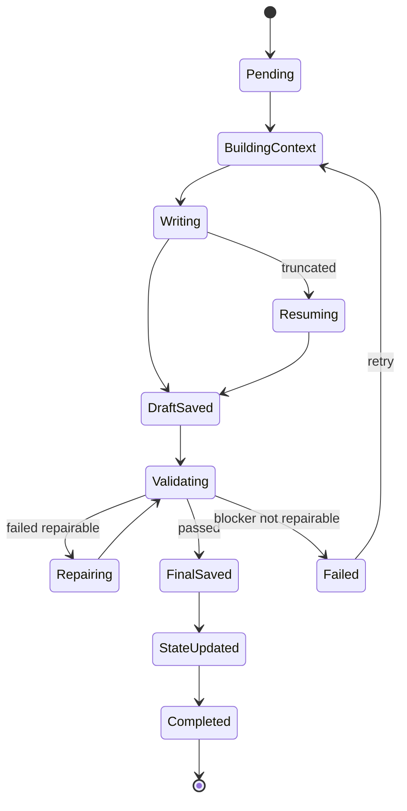

# Skill + MCP + Writing Job Runner Design

这份设计把小说生成拆成三个协作层：Skill 负责“怎么思考/写作”，MCP 负责“能读写什么数据”，Writing Job Runner 负责“什么时候调用、失败怎么办、如何持续生成”。

## 1. Skill 目录规划

建议新增目录：

```text
.claude/skills/
  novel-outline-planner/
    SKILL.md
  novel-chapter-planner/
    SKILL.md
  novel-writer/
    SKILL.md
  novel-realm-validator/
    SKILL.md
  novel-system-ui-validator/
    SKILL.md
  novel-continuity-checker/
    SKILL.md
  novel-repair/
    SKILL.md
  novel-resume/
    SKILL.md
```

### novel-outline-planner

职责：

- 从全局总纲生成结构化 `TimelineEvent[]`。
- 每个事件必须包含 `time`、`characters`、`location`、`event`。
- 补充 `causal_effect`，用于后续章节因果衔接。

输入：

```json
{
  "global_outline": "",
  "worldview": "",
  "protagonist": {},
  "realm_contract": {}
}
```

输出：

```json
{
  "timeline_events": []
}
```

### novel-chapter-planner

职责：

- 将一个或多个 `TimelineEvent` 拆成 3-5 个章节大纲。
- 标注每章消耗哪些事件，避免重复使用或提前透支。
- 调用 RAG 检索相关旧章节、角色状态、实体库和伏笔，防止章节大纲与既有内容冲突。
- 当用户在前端修改事件时间线后，可根据受影响的 `timeline_event_ids` 定向重生成章节大纲。

输出章节大纲字段：

```json
{
  "chapter": 1,
  "title": "",
  "timeline_event_ids": [],
  "goal": "",
  "conflict": "",
  "turning_point": "",
  "ending_hook": "",
  "forbidden_next_events": []
}
```

### novel-writer

职责：

- 只写正文，不做持久化、不更新角色状态。
- 必须遵守 `realm_contract` 和 `system_ui_contract`。
- 输出正文草稿和自检说明。

输入：

```json
{
  "chapter_context": {},
  "realm_contract": {},
  "system_ui_contract": {},
  "continuity_contract": {}
}
```

输出：

```json
{
  "draft": "",
  "self_check": {
    "used_realm_names": [],
    "system_panels": [],
    "potential_risks": []
  }
}
```

### novel-realm-validator

职责：

- 检查正文中的境界、经验值、实力描述是否符合境界表和主角当前状态。
- 判定是否溢出、跳级、使用未定义境界。

优先使用确定性规则：

- 当前境界必须存在于 `RealmLevel[]`。
- 新境界的 `order` 不能超过本章允许上限。
- 文中出现的境界名必须属于境界表。

### novel-system-ui-validator

职责：

- 将用户定义的 `system_ui_template` 编译为可校验契约。
- 检查文中所有系统面板是否 100% 匹配。

示例：

```json
{
  "template": "[宿主：{name} | 等级：{level}]",
  "compiled_regex": "^\\[宿主：.+? \\| 等级：.+?\\]$",
  "fixed_tokens": ["[宿主：", " | 等级：", "]"],
  "variables": ["name", "level"]
}
```

### novel-continuity-checker

职责：

- 检查上一章遗留状态、当前章节大纲、下一章红线。
- 防止跳过受伤角色、提前打完下一章高潮、地点/时间突然断裂。

### novel-repair

职责：

- 根据 `ValidationReport` 做最小必要修复。
- 不允许整章重写，除非 Writing Job Runner 标记 `repair_mode=rewrite`。

### novel-resume

职责：

- 处理模型截断、网络断开、低字数未收束。
- 只续写后半段，不复述前文。

## 2. MCP Tool 规划

建议 MCP server 名称：`novel_project`。

### Resource

```text
novel://project/config
novel://project/preferences
novel://project/timeline
novel://project/chapters/{chapter}/outline
novel://project/chapters/{chapter}/context
novel://project/characters/active
novel://project/protagonist/state
novel://project/jobs/{job_id}
```

### Tools

#### `get_project_contracts`

返回境界、系统 UI、写作风格、校验策略。

```json
{
  "realm_contract": {},
  "system_ui_contract": {},
  "style_contract": {},
  "validation_policy": {}
}
```

#### `get_chapter_context`

输入：

```json
{ "chapter": 52 }
```

返回：

```json
{
  "chapter": 52,
  "chapter_outline": {},
  "timeline_events": [],
  "previous_continuity": "",
  "next_chapter_boundary": {},
  "active_characters": [],
  "protagonist_state": {},
  "related_rag_scenes": []
}
```

#### `search_planning_memory`

为事件时间线和章节大纲生成提供 RAG 结果。

输入：

```json
{
  "query": "事件或章节规划目标",
  "scope": ["chapters", "characters", "entities", "foreshadowing"],
  "top_k": 8
}
```

返回：

```json
{
  "matches": [
    {
      "source": "chapter",
      "chapter": 12,
      "title": "力量的代价",
      "content": "相关片段",
      "reason": "为什么和当前规划相关"
    }
  ]
}
```

#### `save_chapter_draft`

草稿进入 `.webnovel/runtime/drafts`，不直接覆盖正文。

#### `save_chapter_final`

只有所有 blocker 校验通过后，才写入 `正文/`。

#### `save_validation_report`

保存每轮校验结果，前端可展示。

#### `update_story_state`

正文通过后更新角色状态、主角境界、连续性摘要、RAG 索引。

## 3. Writing Job Runner 状态机



## 4. 连续生成策略

连续生成不是“一个大 Prompt 写很多章”，而是任务队列。

```json
{
  "job_id": "write-range-20260505-001",
  "chapter_start": 55,
  "chapter_end": 80,
  "mode": "serial",
  "stop_on_blocker": true,
  "auto_repair": true,
  "max_repair_attempts": 2,
  "max_resume_attempts": 3
}
```

执行规则：

- 每章独立 checkpoint。
- 只有当前章完成并更新状态后，才进入下一章。
- 出现 blocker 时暂停队列，前端提示人工处理。
- 网络或模型失败按同一章同一阶段重试。

## 5. 与现有代码的关系

短期不删除旧 `SkillExecutor`，而是新增旁路：

```text
FastAPI
  old: /api/ai/write-stream -> SkillExecutor.execute_write_stream
  new: /api/jobs/write-range -> WritingJobRunner.run
```

等新链路稳定后，再逐步将旧写作按钮切到 Writing Job Runner。
